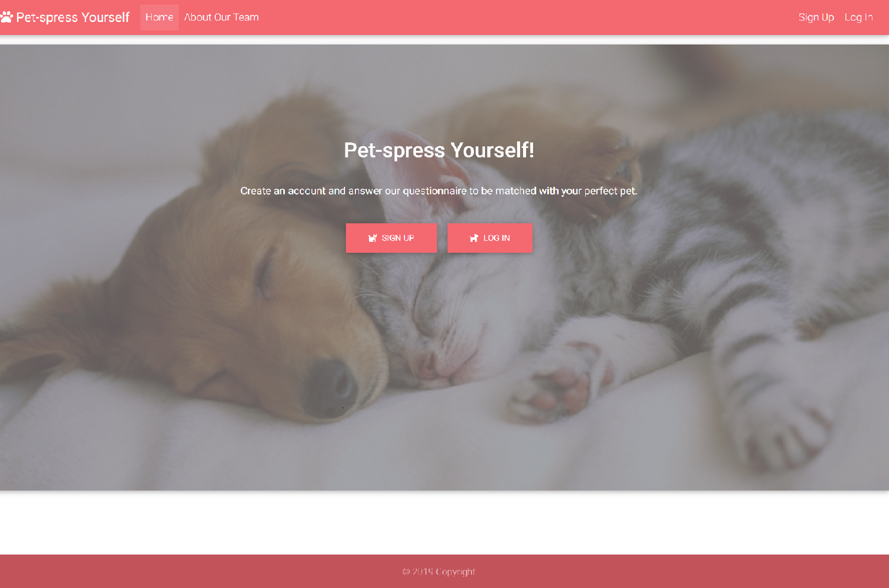
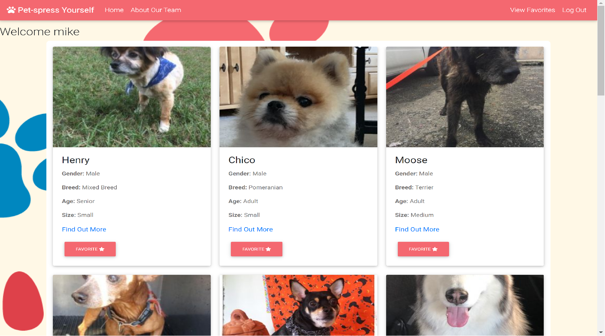
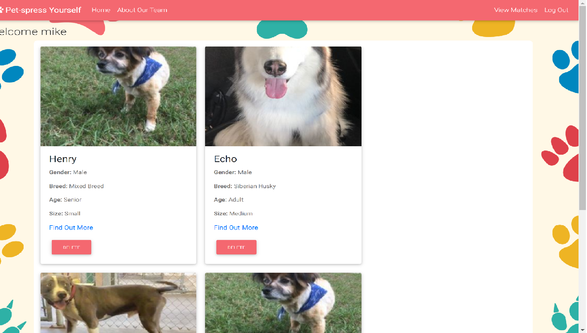

# PET-SPRESS_YOURSELF!

Pet-spress yourself is a website that matches users to adoptable dogs in the Orlando area.  It uses the users current living conditions to find the cat or dog that will be perfect for them!

### Team Members
### Ryan Goderis- Lead Developer/ back end
### Michelle Mesorana- front end / back end
### Michael Praplaski- back end

## Walk through of the app

## Home Page

Users will be greeted on the home page with an option to sign up or log in.

## Sign up Page

New users that select sign up will be redirected to a sign up form where they give a username email and password.  They will also be asked wether they prefer dogs or cats, if they live in an appartment or house, if they have childrend, cats, or dogs and also how active they are.

## Login Page

Users that are already signed up will click on log in and be redirected to a login screen.

The login screen will ask for the username email and password.  Once those text fields have been filled out with the correct information the user will be redicrected to there results page.

## Results/Profile Page

Once you have signed up or logged in you will be redirected to your profile page where up to 15 dogs or cats that you've been matched with will show.  Each animal card will show a picture of them and also have their name, gender, age, size, a link for more information and a favorite button.  By clicking the favorite button it saves the animal to your favorites page so that you can come back another time and easily find the animals that you favorited.

## Favorites Page

The favorites page shows the dogs or cats that you have favorited.

## Things for version 2.0

* Have the animals table auto update.
* Show all the results instead of the 15 we currently show.
* Let users update their survey.
